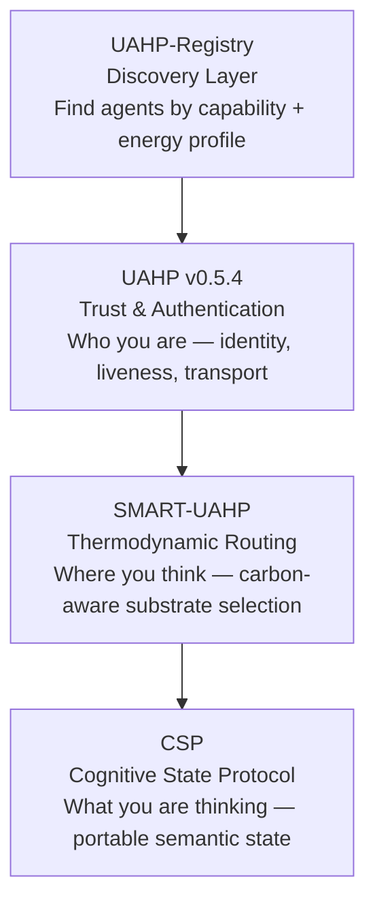

## The UAHP Agentic Stack

Four layers. One complete infrastructure for the agentic web.

| Layer | Repo | Role |
|-------|------|------|
| Discovery | UAHP-Registry | Find agents by capability and energy profile |
| Trust | UAHP v0.5.4 | Identity, liveness proofs, signed handshakes |
| Routing | SMART-UAHP | Carbon-aware substrate selection |
| State | CSP | Portable semantic state transfer |

# UAHP-Registry
Thermodynamic-aware, liveness-native discovery layer for the UAHP agentic stack
